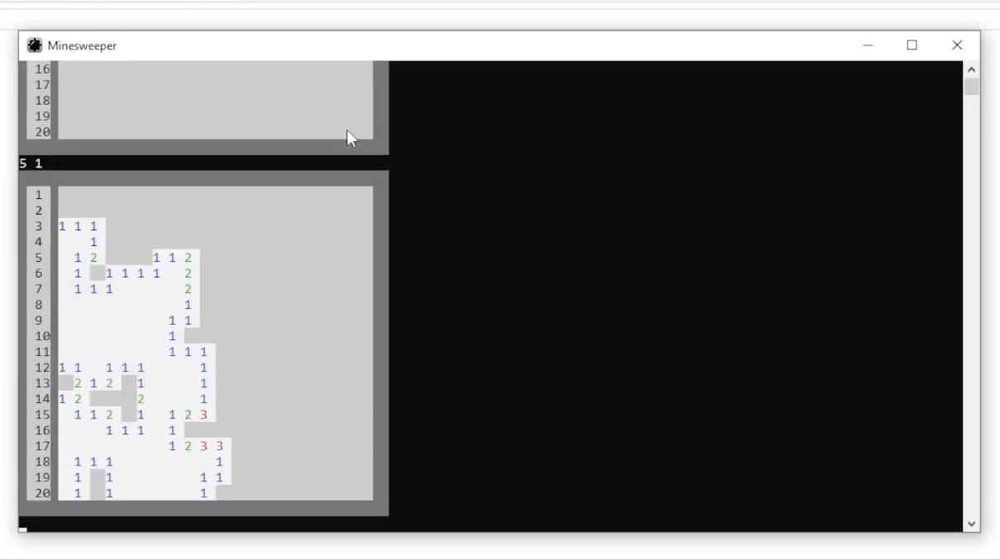
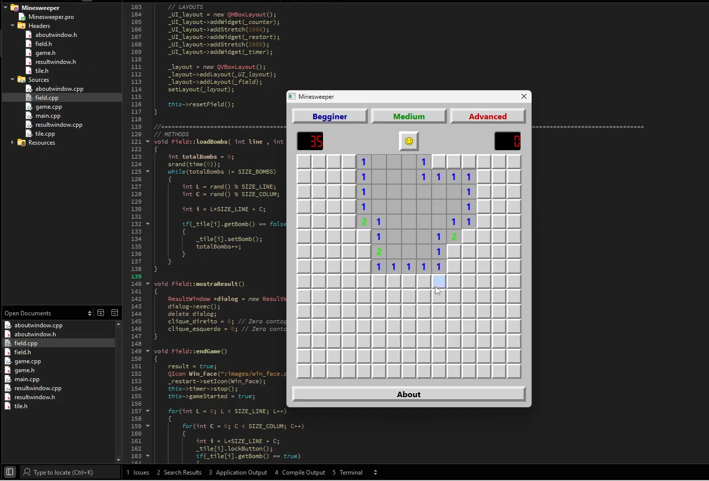

# Campo Minado em C++ e Qt

Projeto desenvolvido como trabalho final da disciplina de `Programação Orientada a Objetos`, utilizando **C++** e o framework **Qt**, com desenvolvimento realizado no ambiente Qt Creator.

O projeto é uma reformulação de uma versão anterior do jogo **Campo Minado**, desenvolvida por iniciativa pessoal e executada inteiramente através do terminal do Windows.

Na versão original, toda a interação com o usuário era realizada por meio de comandos e as informações eram exibidas no console através. Posteriormente, durante a disciplina de Programação Orientada a Objetos, surgiu a oportunidade de revisitar o projeto e reestruturá-lo utilizando os conceitos estudados em aula.

 

<b>Campo minado no console</b>

A nova versão teve como principais objetivos:

* Reorganizar o código utilizando programação orientada a objetos;
* Separar responsabilidades entre as diferentes partes do programa;
* Desenvolver uma interface gráfica utilizando Qt;
* Substituir a interação por linha de comando por uma interface visual mais intuitiva;
* Reaproveitar e aprimorar a lógica desenvolvida na versão original.

Dessa forma, o projeto permitiu comparar diretamente duas abordagens diferentes para a implementação do mesmo jogo, evidenciando a evolução tanto da estrutura do software quanto da interface com o usuário.

## Versões do projeto

### Versão original — Console

Primeira implementação do Campo Minado, desenvolvida como projeto pessoal e executada através do terminal.

A interação com o usuário era realizada por comandos digitados no console.

🎥 [Campo Minado — versão CMD](https://www.youtube.com/watch?v=EAc7InIspGk)

### Versão reformulada — C++ e Qt

Versão desenvolvida para a disciplina de Programação Orientada a Objetos, com reestruturação do código e implementação de uma interface gráfica utilizando Qt.

🎥 [Campo Minado — versão Qt](https://www.youtube.com/watch?v=cRCnXJNNElE)

## Resultado

<!-- O projeto foi apresentado como trabalho final da disciplina de Programação Orientada a Objetos e recebeu **nota 10,0**. -->

 

<b>Campo minado no Qt</b>

